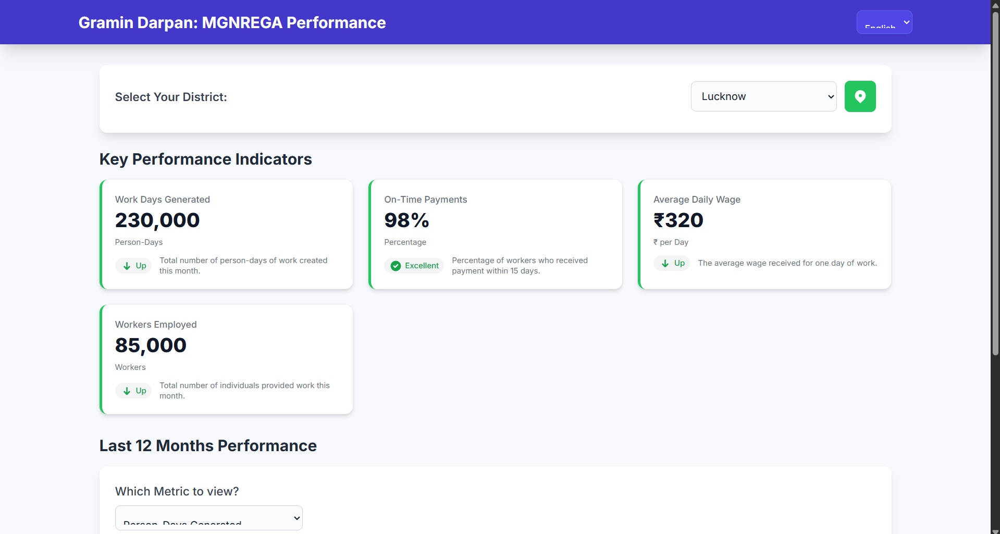
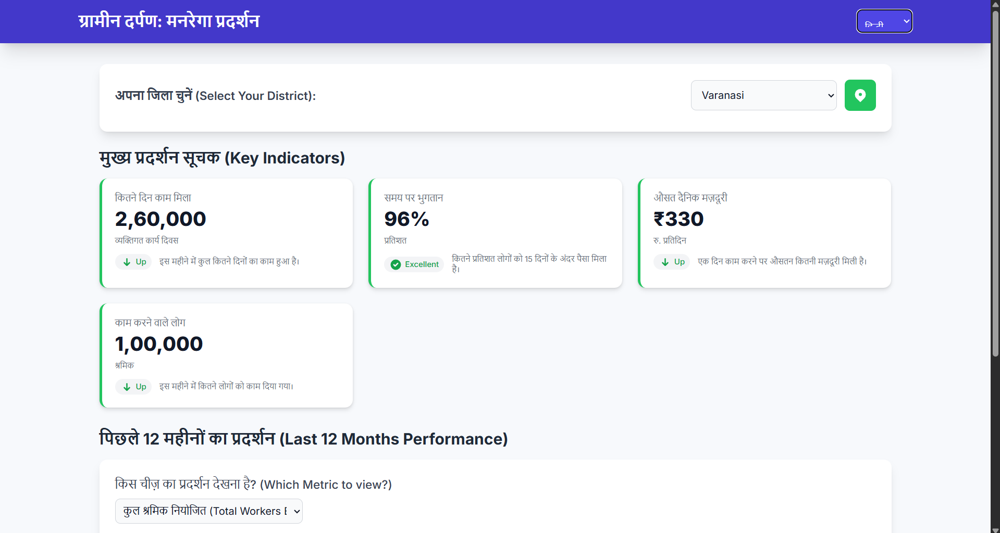

<div align="center">


<br/><br/>

# 🌾 ग्रामीन दर्पण — DistrictPerformance

### *A bilingual MGNREGA district performance analytics dashboard for rural India*

<p align="center">
  <a href="https://district-performance.vercel.app/">Live Demo</a> •
  <a href="#-features">Features</a> •
  <a href="#-screenshots">Screenshots</a> •
  <a href="#-tech-stack">Tech Stack</a> •
  <a href="#-getting-started">Get Started</a> •
  <a href="#-data">Data</a>
</p>

</div>

---

## 📌 Overview

**ग्रामीन दर्पण** *(Gramin Darpan — "Rural Mirror")* is an interactive, single-page web dashboard that tracks and visualizes **MGNREGA (Mahatma Gandhi National Rural Employment Guarantee Act)** performance data across districts of Uttar Pradesh.

Designed with rural government workers and gram panchayat officials in mind, the dashboard is fully bilingual **(Hindi 🇮🇳 + English 🌐)** and works offline — no backend required.

> 💡 Empowering data transparency at the grassroots level, one district at a time.

---

## ✨ Features

| Feature | Description |
|---|---|
| 🗺️ **District Selector** | Browse performance data for multiple UP districts |
| 📍 **Geolocation** | Auto-detect your district with a single click |
| 📊 **D3.js Charts** | Interactive bar charts for 12-month trend analysis |
| 🎯 **KPI Cards** | At-a-glance key performance indicators per district |
| 🌐 **Bilingual UI** | Seamlessly switch between Hindi and English |
| 📱 **Responsive Design** | Mobile-first layout with Tailwind CSS |
| ⚡ **Zero Dependencies** | Pure HTML + JS — runs entirely in the browser |
| 🔢 **Smart Formatting** | Auto-formats large numbers as Lakh / Crore |

---

## 🖼️ Screenshots


### 🏠 Dashboard Overview
<p align="center">
  
</p>

<br/>

### 📊 Performance Chart (D3.js)
<p align="center">
  
</p>

<br/>

### 🌐 Hindi Language Mode
<p align="center">
  
</p>

---

## 🛠️ Tech Stack

```
Frontend     →   HTML5, Tailwind CSS (CDN), Vanilla JavaScript
Charts       →   D3.js v7
Typography   →   Google Fonts — Inter + Noto Sans Devanagari
Data         →   Embedded JSON (offline-ready)
```

---

## 🚀 Getting Started

No installation. No build step. No server needed.

### Option 1 — Open Directly
```bash
# Clone the repo
git clone https://github.com/mansiggit/District_Performance.git

# Navigate into it
cd District_Performance

# Open in browser
open index.html        # macOS
start index.html       # Windows
xdg-open index.html    # Linux
```

### Option 2 — Live Server (Recommended for Dev)
```bash
# If you have VS Code + Live Server extension
# Right-click index.html → "Open with Live Server"
```

That's it! 🎉

---

## 📈 Tracked Metrics

The dashboard tracks **4 key MGNREGA indicators** over a rolling 12-month window:

| Metric | Description | Unit |
|---|---|---|
| 📅 **Days Generated** | Total workdays created under the scheme | Count (Lakh) |
| ⏱️ **On-Time Payment %** | Percentage of wages paid within 15 days | % |
| 💰 **Average Wage** | Average daily wage paid to workers | ₹ (Rupees) |
| 👷 **Workers Employed** | Total unique workers who got employment | Count (Lakh) |

---

## 🗂️ Data

Data is **embedded directly** in `index.html` as a JavaScript object — making this dashboard fully offline-capable and easy to deploy on any static host.

**Districts currently covered:**

> Lucknow · Prayagraj · Varanasi · *(more can be added)*

To add a new district, extend the `mgnregaData` object in the `<script>` section of `index.html` following the existing format:

```js
"DistrictName": [
  { "month": "Jan-2024", "days_generated": 100000, "on_time_payment_percent": 85, "avg_wage": 280, "workers_employed": 50000 },
  // ... 12 months of data
]
```

---

## 🗺️ Roadmap

- [ ] Add more Uttar Pradesh districts
- [ ] Connect to live MGNREGA API (data.gov.in)
- [ ] Add PDF/CSV export of reports
- [ ] Comparison view for two districts side-by-side
- [ ] District-level map (choropleth) using D3.js
- [ ] PWA support for offline mobile use

---

<div align="center">

Made with ❤️ for rural India's workforce transparency

⭐ **Star this repo** if you find it useful!

</div>
